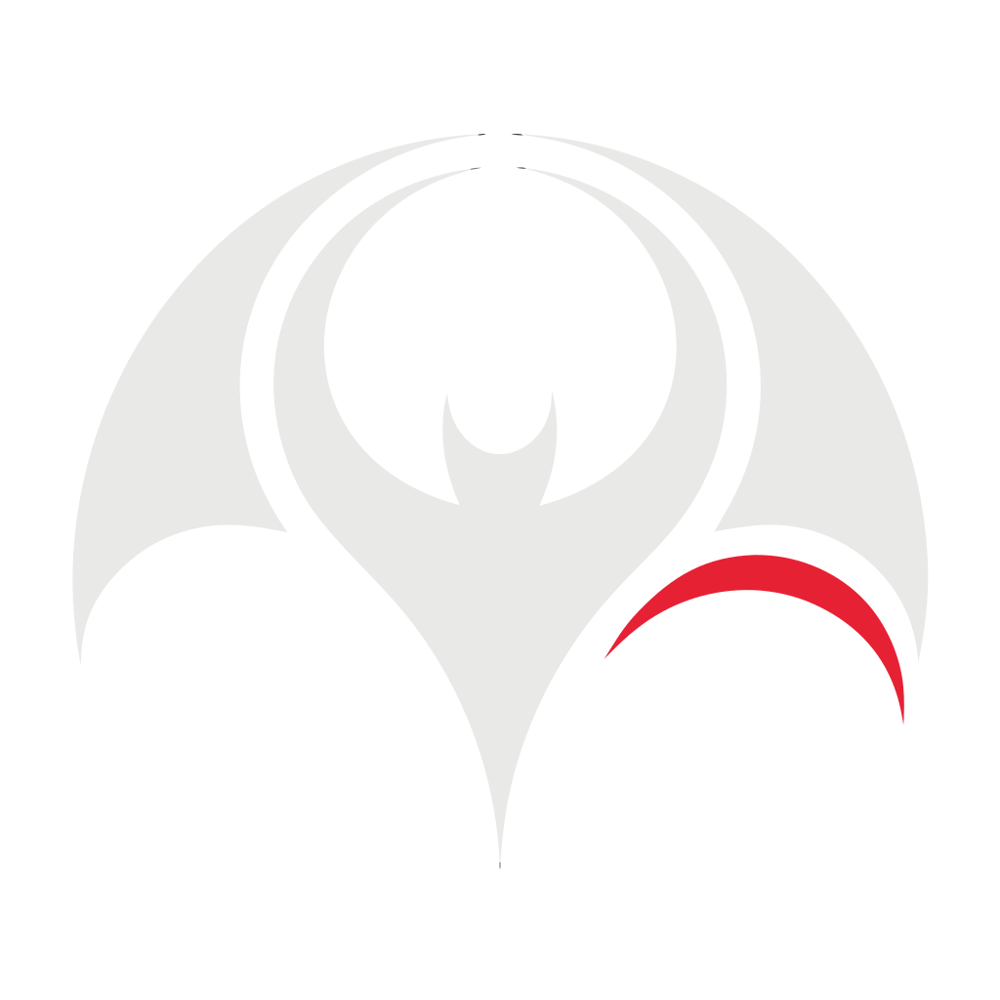
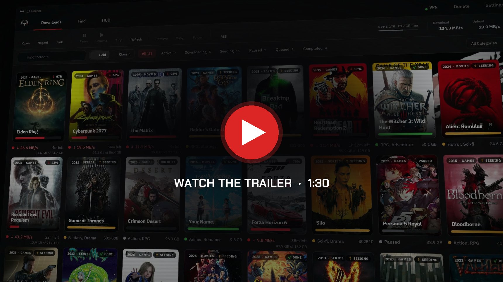
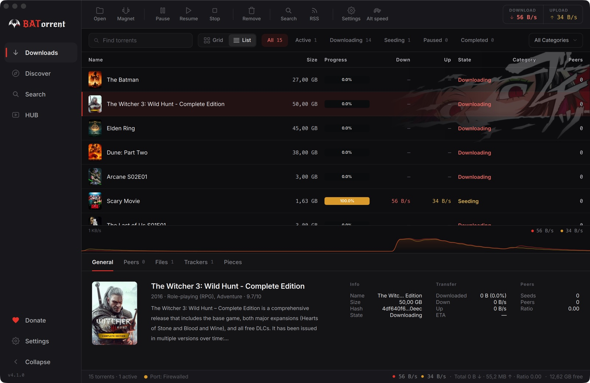
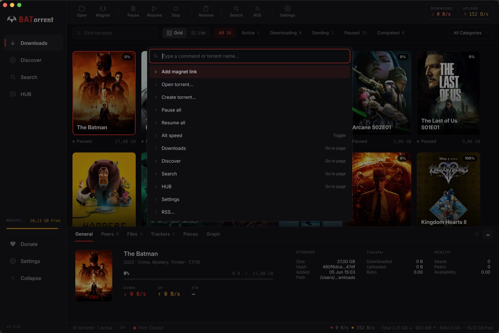
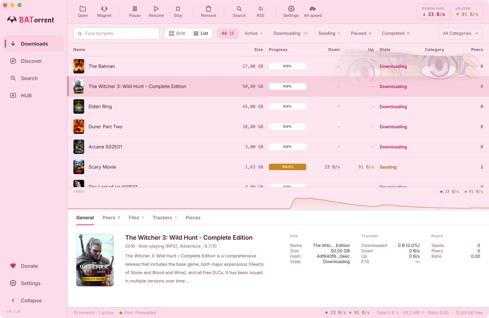
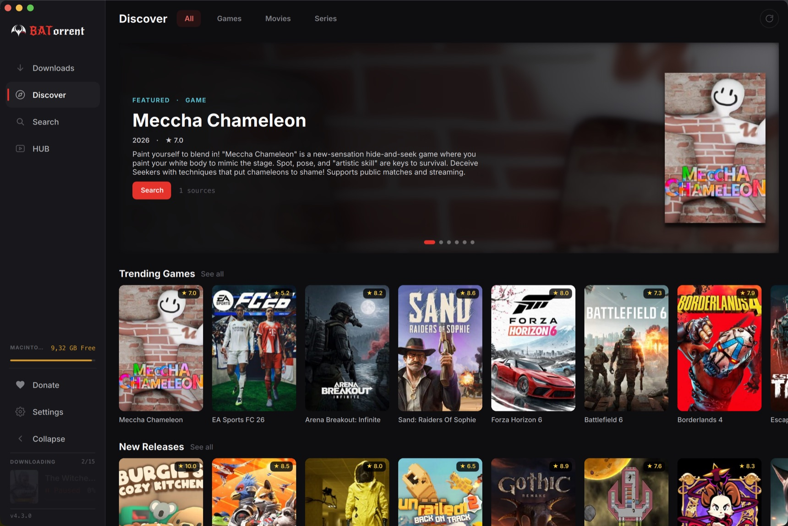
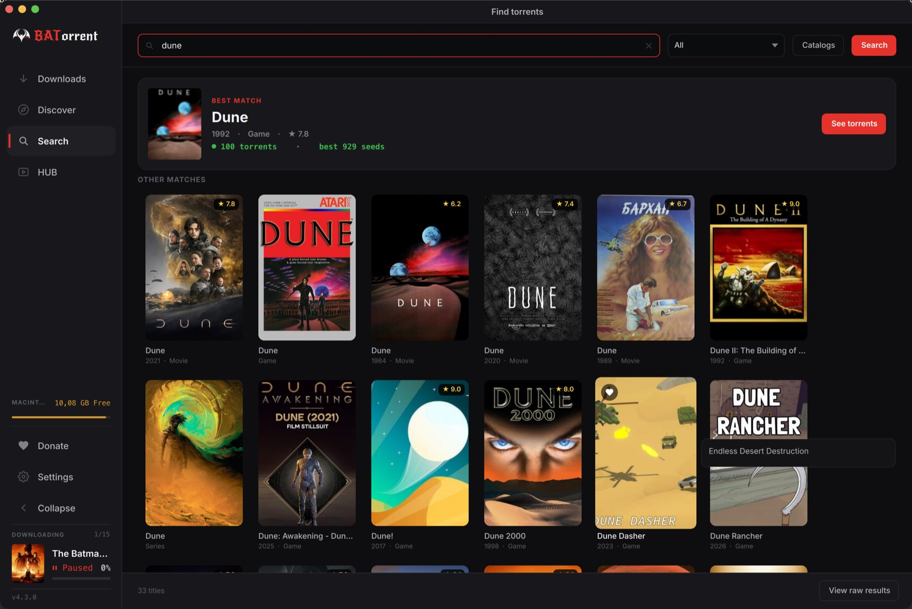

<p align="center">
  <a href="README.md">English</a> | <a href="README.pt-BR.md">Português</a> | <a href="README.zh-CN.md">中文</a> | <a href="README.ja.md">日本語</a> | <b>Русский</b> | <a href="README.es.md">Español</a> | <a href="README.de.md">Deutsch</a> | <a href="README.ua.md">Українська</a>
</p>

<p align="center">
  
</p>

<h1 align="center">BATorrent</h1>

<p align="center">
  <i>BitTorrent-клиент, который показывает ваши загрузки обложками, а не строками таблицы.</i>
</p>

<p align="center">
  <a href="https://github.com/BATorrent-app/BATorrent/releases/latest"></a>
  <a href="https://github.com/BATorrent-app/BATorrent/releases"></a>
  <a href="LICENSE"></a>
  
  <a href="https://apps.microsoft.com/detail/9n4l3tq24rc6"></a>
</p>

<p align="center">
  <a href="https://batorrent.com/assets/trailer.mp4"></a>
</p>

BATorrent это десктопный торрент-клиент на движке [libtorrent](https://www.libtorrent.org/), том же, что используют qBittorrent и Deluge. Интерфейс читает имя каждого торрента, находит подходящий постер (фильмы и сериалы через TMDB, игры через IGDB) и выкладывает загрузки сеткой обложек вместо списка имён файлов. Под этим работает полноценный клиент на [пропатченной сборке того же движка](#движок).

Он бесплатный и с открытым исходным кодом: без рекламы, телеметрии, «Pro»-версии и аккаунта. Единственный сетевой запрос, который он делает сам, это проверка обновлений на GitHub, и её можно отключить переключателем. Проверить это можно в коде: [`updater.cpp`](src/services/integrations/updater.cpp).

## Зачем я его сделал

Я один разработчик из Бразилии. Мне был нужен торрент-клиент, который серьёзно относится к приватности, нативно работает на Windows, macOS и Linux и не выглядит так, будто его нарисовали в 2009 году. Подходящего я не нашёл, поэтому написал свой. Он под лицензией MIT, так что если в проекте когда-нибудь появятся телеметрия или реклама, любой сможет форкнуть код и выпустить версию без них. Интерфейс переведён на девять языков.

## Интерфейс

<p align="center">
  
</p>

<p align="center">
  
</p>

<p align="center">
  
</p>

- **Обложки.** Клиент находит постеры по имени торрента и показывает их сеткой. Одним кликом можно переключиться на компактный список, если подробности важнее оформления.
- **Шесть тем.** Dark, Light, Midnight, Sakura, Dark Star и Custom, где фон и акцентный цвет выбираете вы. К каждой можно включить аниме-арт.
- **Палитра команд.** Ctrl/⌘+K открывает нечёткий поиск по любому торренту или действию: поставить всё на паузу, включить альтернативную скорость, перейти на любую страницу. Мышь для этого не нужна.
- **Статус в реальном времени.** График скорости, полосы прогресса с цветом по состоянию и всплывающее окно в трее с текущими скоростями и оставшимся временем.

## Что он умеет

**Смотреть прямо в приложении.** Встроенный видеоплеер работает на FFmpeg, поэтому MKV, AVI и WebM воспроизводятся напрямую. Смотреть можно, пока файл ещё качается: начало загружается первым. Плеер сам ищет и скачивает субтитры (через SubDL), автоматически подхватывает лежащие рядом файлы `.srt`/`.vtt` и позволяет подстраивать синхронизацию на ходу. По завершении загрузки клиент может обновить библиотеку Plex, Jellyfin или Emby.

**Мгновенный просмотр через debrid.** Подключите аккаунт [Real-Debrid](https://real-debrid.com) или [TorBox](https://torbox.app), и если magnet уже есть у них в кэше, BATorrent получит прямую ссылку и пустит поток сразу во встроенный плеер. На ваш компьютер ничего не скачивается и ничего не раздаётся.

**Игры тоже.** Игровые торренты тоже получают обложки (через IGDB). Можно искать по каталогам игр, скачивать, а потом устанавливать и запускать прямо из приложения, так что пиратская библиотека становится немного похожа на список в Steam, а не на папку с установщиками.

**Обзор.** Главная страница в духе Netflix (популярные постеры, сменяющийся баннер), где можно найти что скачать, не выходя из приложения.

<p align="center">
  
</p>

**Приватность.** Привязка к конкретному VPN-интерфейсу с kill switch, который обрывает весь трафик, если туннель упал. Есть режим для приватных трекеров, пресет Tor, анонимный handshake и блокировка клиентов-пиявок. Встроенный тест утечки IP показывает, что всё работает.

**Поиск и добавление.** Встроенный поиск (включая открытые источники СНГ/RuTor, где не нужен логин), Smart Paste, который по Ctrl+V распознаёт magnet, `.torrent`, ссылку `thunder://` или info hash, автозагрузка по RSS с regex-фильтрами, папка наблюдения и drag-and-drop.

<p align="center">
  
</p>

**Удалённое управление.** WebUI в браузере с сопряжением по QR: отсканируйте код телефоном, и IP-адреса вводить не придётся. QR генерируется на вашем компьютере, и адрес никуда за его пределы не уходит.

**Упорядочивание.** Автораспаковка архивов по завершении, категории и теги, лимиты рейтинга и времени для каждого торрента и глобально, расписание скорости по часам и дням.

**Уведомления.** Нативные уведомления на рабочем столе, сообщения в Telegram и Discord Rich Presence.

<details>
<summary><b>Полный список функций</b></summary>

Приоритет отдельных файлов, последовательная загрузка, автоматическое добавление трекеров, управление раскладкой содержимого, regex для исключения файлов, отдельная временная папка загрузки, состояние «Завершено» с окнами раздачи, автопауза при ошибках файлов, глобальные и по-торрентные лимиты рейтинга и времени, планировщик скорости по часам и дням, импорт из qBittorrent, создание `.torrent`, инспектор торрентов, IP-блоклисты, шифрование протокола, зеркало обновлений на Gitee, автовыключение после завершения загрузок, помощник для добавления исключения в Windows Defender, полное резервное копирование и восстановление, история недавно удалённых, принудительный запуск, встроенный просмотр логов с диагностикой и тестом утечки IP, форматирование с учётом локали и горячие клавиши.

</details>

## Движок

Большинство торрент-клиентов линкуют стандартный libtorrent. BATorrent поставляется с небольшим пропатченным форком, поэтому может менять поведение движка там, куда публичный API не дотягивается:

- **Быстрый разгон конвейера.** На широком канале с большой задержкой стандартный конвейер запросов растёт по одному шагу, а форк наращивает его геометрически и заполняет толстый канал за малую долю обменов. В собственном A/B-бенчмарке проекта это дало примерно +27% на быстром канале, без провалов между прогонами, которые бывают у стандартной версии, и регрессий не было ни разу.
- **Предпочтение пиров из своей страны.** Офлайн-база GeoIP (db-ip Lite) помечает каждый пир страной, и при выборе форк ставит выше пиров из вашей страны. Обычно это значит меньшую задержку и меньше зарубежных маршрутов с ограничением скорости.

Обе возможности включаются при компиляции форка, в стандартной сборке они выключены. Они хранятся как версионированные патчи в [`third_party/patches/`](third_party/patches), а не как вложенная копия исходников.

## Установка

| Платформа | Загрузка | Требования |
|---|---|---|
| **Windows** | [Microsoft Store](https://apps.microsoft.com/detail/9n4l3tq24rc6), [установщик](https://batorrent.com/win) или [портативная версия](https://batorrent.com/portable) | Windows 10 или новее |
| **macOS** | `brew install --cask Mateuscruz19/batorrent/batorrent` или [`.dmg`](https://batorrent.com/mac) | macOS 12+, Apple Silicon |
| **Linux** | [AppImage](https://batorrent.com/linux) | glibc 2.35+ |

После запуска перетащите в окно файл `.torrent` или magnet-ссылку.

<sub><b>Для macOS:</b> приложение пока не нотаризовано (программа разработчика Apple это платная подписка). Проще всего ставить через Homebrew: <code>brew</code> снимает флаг карантина, и приложение открывается без запроса Gatekeeper. Если вы берёте <code>.dmg</code>, в первый раз щёлкните по приложению правой кнопкой и выберите <b>Открыть</b>.</sub>

<details>
<summary><b>Сборка из исходников</b></summary>

**Требования:** C++17, CMake 3.16+, Qt 6 (`Widgets`, `Network`, `Svg`, `Multimedia`), libtorrent-rasterbar 2.0+, Boost и, по желанию, Qt6Keychain.

```bash
# Debian / Ubuntu
sudo apt install build-essential cmake qt6-base-dev qt6-svg-dev qt6-multimedia-dev \
    libtorrent-rasterbar-dev libboost-dev libssl-dev
cmake -B build -DCMAKE_BUILD_TYPE=Release && cmake --build build -j && ./build/BATorrent
```

На macOS: `brew install qt libtorrent-rasterbar boost openssl`.
На Windows: установщик Qt и `vcpkg install libtorrent:x64-windows`.

</details>

<details>
<summary><b>Качество и безопасность</b></summary>

<p>
  <a href="https://github.com/BATorrent-app/BATorrent/actions/workflows/codeql.yml"></a>
  <a href="https://github.com/BATorrent-app/BATorrent/actions/workflows/sanitizers.yml"></a>
  <a href="https://sonarcloud.io/summary/new_code?id=Mateuscruz19_BAT-Torrent"></a>
  <a href="https://www.codefactor.io/repository/github/mateuscruz19/batorrent"></a>
  <a href="https://www.bestpractices.dev/projects/13073"></a>
</p>

- Набор тестов на Catch2 (модульные, безопасность, память) прогоняется в каждой CI-сборке, и новое поведение бэкенда добавляется вместе с тестом.
- Сборка проходит чисто под AddressSanitizer и UndefinedBehaviorSanitizer.
- Перед каждым релизом код проверяется на безопасность работы с памятью и потоками, аутентификацию WebUI, инъекции, path traversal, валидацию ввода и обращение с секретами. Секреты хранятся в keychain ОС, а не открытым текстом, и WebUI становится доступен из сети только после того, как вы зададите пароль.

</details>

## Участие

Issues и pull requests приветствуются. Если изменение нетривиальное, сначала откройте issue, чтобы договориться о подходе. В сообщении об ошибке полезнее всего указать платформу и версию (из `Справка → О программе`) и шаги для воспроизведения. Переводам особенно рады.

## Лицензия и товарный знак

**Код** распространяется под лицензией [MIT](LICENSE), © 2024-2026 Mateus Cruz. Вы можете форкнуть его и выпускать собственную сборку.

**Название «BATorrent» и логотип** принадлежат проекту, и лицензия на код на них не распространяется. Если вы распространяете форк, дайте ему, пожалуйста, своё название, чтобы пользователи могли отличить официальную сборку. Подробности в [TRADEMARK.md](TRADEMARK.md). Добросовестным форкам и вкладу в проект мы рады.

Сделано в Бразилии.
